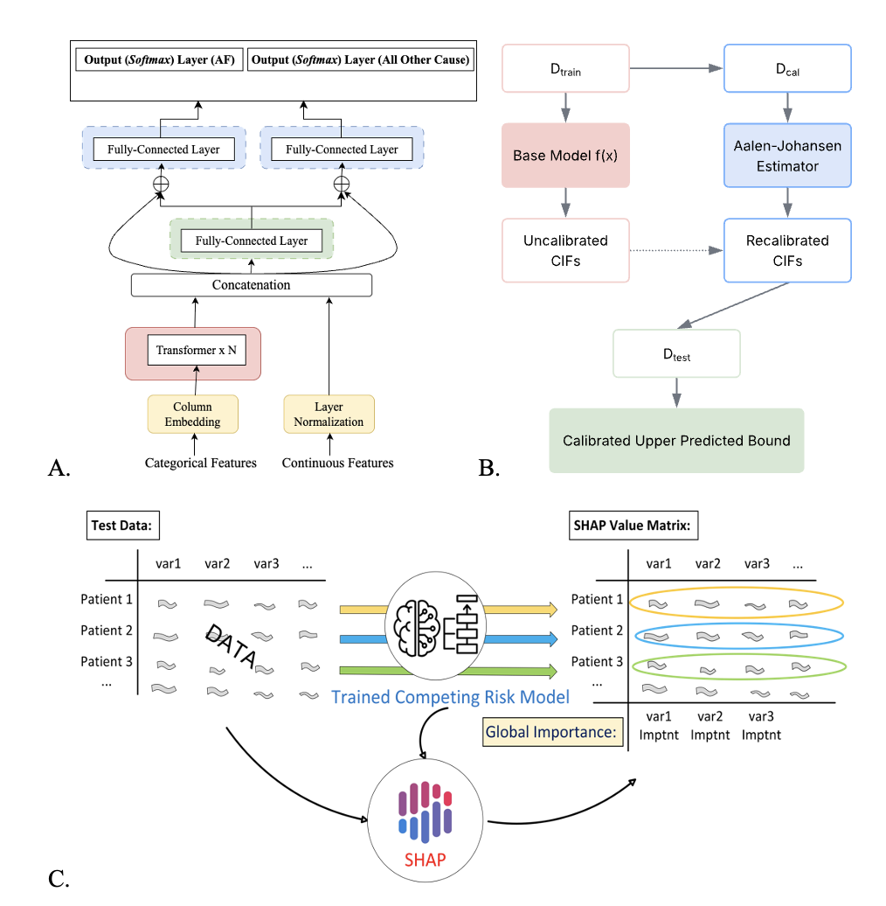

# UCTT-RP: Uncertainty-Calibrated Tabular Transformer for Atrial Fibrillation Risk Prediction

This repository contains the implementation of **UCTT-RP**
(**Uncertainty-Calibrated Interpretable Tabular Transformer Model for Competing Risk Prediction**), an end-to-end deep survival learning framework for individualized atrial fibrillation (AF) risk prediction in the presence of competing risks.

The project applies transformer-based representation learning, competing-risk survival modeling, uncertainty calibration, and model interpretability to a large real-world clinical cohort from the Cardiovascular Imaging Registry of Calgary.

## Overview

Atrial fibrillation is a common cardiac arrhythmia associated with major adverse outcomes, including stroke, heart failure, and mortality. Accurate individualized AF risk prediction is clinically important but remains challenging because real-world clinical data often contain heterogeneous feature types, missing values, nonlinear risk-factor interactions, competing events, and limited interpretability.

UCTT-RP is designed to address these challenges by integrating:

* A tabular transformer for robust representation learning from mixed clinical variables
* Deep competing-risk survival modeling for joint prediction of AF and death
* Aalen-Johansen-based post-hoc recalibration of cumulative incidence functions
* Event-time upper predicted bounds for uncertainty-aware risk estimation
* Feature attribution using permutation importance and SHAP
* A Shiny-based user interface for individualized risk prediction

## Study Cohort

The model was developed and evaluated using a real-world clinical cohort derived from the Cardiovascular Imaging Registry of Calgary.

After preprocessing, the analytic cohort included:

* 106,615 participants
* 108 demographic, clinical, laboratory, medication, and electrocardiographic features
* Incident atrial fibrillation as the primary outcome
* Death as a competing-risk endpoint

Patients were assigned to training, validation, calibration, and test sets for model development, hyperparameter tuning, recalibration, and final performance evaluation.

## Model Architecture

UCTT-RP contains three main components.

<p align="center">
  
</p>

**Figure 1. Overall architecture and analytical workflow of the UCTT-RP framework.**  
(A) End-to-end deep survival architecture integrating tabular transformer-based feature representation and competing-risk modeling.  
(B) Aalen-Johansen-based post-hoc recalibration of cumulative incidence functions and construction of calibrated upper predicted bounds.  
(C) Model interpretation workflow using SHAP values to identify global and patient-level feature contributions.


### 1. Tabular Transformer Feature Representation

Categorical and continuous clinical variables are processed using a tabular transformer architecture. Categorical variables are embedded using feature-specific column embeddings, while continuous variables are normalized and concatenated with contextualized embeddings.

The transformer module captures nonlinear and high-order interactions among heterogeneous clinical variables and generates a unified patient-level representation.

### 2. Deep Competing-Risk Survival Model

The learned patient representation is passed into a DeepHit-style competing-risk survival model. The model jointly estimates event-specific cumulative incidence functions for:

* Incident atrial fibrillation
* Death before atrial fibrillation

This competing-risk formulation accounts for the fact that death can preclude future observation of AF onset.

### 3. Uncertainty Calibration

To improve calibration of predicted cumulative incidence functions, UCTT-RP applies post-hoc recalibration using the Aalen-Johansen estimator as a nonparametric reference.

The recalibrated cumulative incidence functions are then used to derive event-time upper predicted bounds, providing uncertainty-aware summaries of predicted AF and competing-risk event times.

## Model Interpretation

To improve clinical transparency, the project includes a two-stage interpretation pipeline:

1. **Permutation feature importance** is used to identify globally important predictors.
2. **SHAP analysis** is used to quantify the direction and magnitude of feature contributions to individualized AF risk prediction.

Important predictors identified in the study include demographic factors, laboratory biomarkers, electrocardiographic variables, and clinical comorbidities.

## Baseline Models

UCTT-RP was compared with several baseline and ablation models:

* DeepHit trained directly on raw clinical features
* Two-stage UCTT-RP model
* Random Survival Forest for competing risks

Model performance was evaluated using:

* Time-dependent concordance index
* Integrated Brier score
* Coverage of event-time upper predicted bounds

## Shiny Application

A Shiny-based web application was developed to support clinical translation of the model.

The interface allows users to:

* Enter patient-level clinical variables manually
* Upload patient data using CSV files
* Generate individualized AF and competing-risk predictions
* Visualize time-dependent event probability and survival curves
* Export prediction results
* Compute patient-level feature importance

The application is designed to make individualized AF risk prediction more accessible for research and clinical workflows.

## Repository Structure

```text
UCTT-RP-AF-Prediction/
├── README.md
├── requirements.txt
├── notebooks/
│   ├── End-to-end.ipynb
│   ├── Table1.ipynb
│   ├── Train_tab.ipynb
│   ├── Tab_no_train.ipynb
│   └── SHAP.ipynb
├── R/
│   └── RandomForest.R
├── data/
│   └── README.md
├── results/
│   └── README.md
└── docs/
    └── method_overview.md
```

## Expected Data Format

The code assumes that the preprocessed data are stored as CSV files using the following split structure:

```text
data/
├── train.csv
├── val.csv
├── cal.csv
├── test.csv
└── bootstrap500/
    ├── bootstrap_1.csv
    ├── bootstrap_2.csv
    └── ...
````

Each data split should contain clinical feature columns and two outcome columns:

* `year`: observed follow-up time or event time
* `status`: event indicator

The `status` variable is defined as:

| Value | Meaning                                                   |
| ----: | --------------------------------------------------------- |
|   `0` | Censored                                                  |
|   `1` | Incident atrial fibrillation                              |
|   `2` | Competing event, such as death before atrial fibrillation |

The current notebooks use project-specific absolute paths, such as:

```text
/home/UT_shared/data/
```

Before running the code on a new machine, update these paths to match the local repository structure.

```
```


## Data Availability

The clinical data used in this study contain sensitive patient-level information and are not publicly available.

Example input files and synthetic data templates may be provided for demonstration purposes.

## Repository Status

This repository is currently under preparation. Code, documentation, and example files will be updated before public release.

## Citation

Citation information will be added upon publication.

## License

License information will be added before public release.

## Contact

For questions about this project, please contact the project maintainer.
